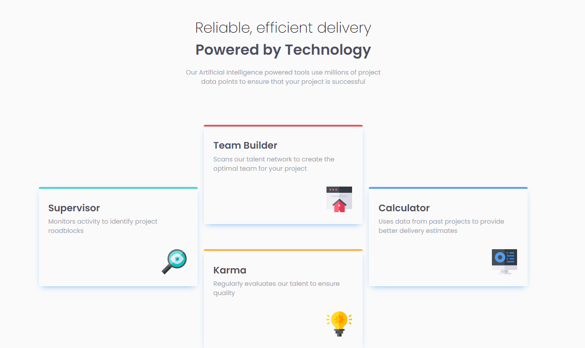
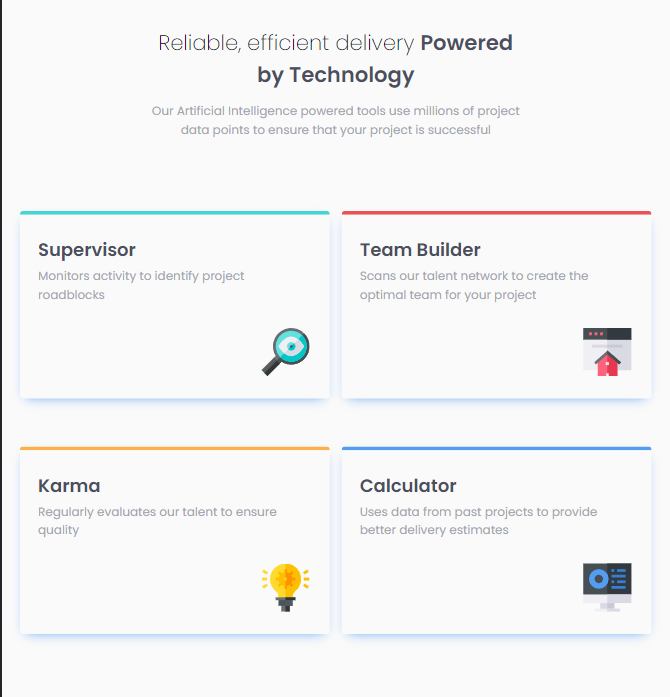
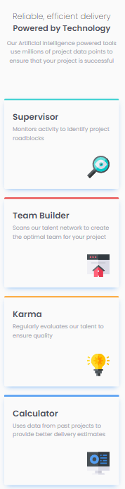

# Frontend Mentor - Four card feature section solution

This is a solution to the [Four card feature section challenge on Frontend Mentor](https://www.frontendmentor.io/challenges/four-card-feature-section-weK1eFYK). Frontend Mentor challenges help you improve your coding skills by building realistic projects.

## Overview

### The challenge

Users should be able to:

- View the optimal layout for the site depending on their device's screen size

### Screenshot

> Desktop screenshot

  
> Tablet screenshot

  
> Mobile screenshot

  

### Links

- Live Site URL: [GitHub Pages](https://bilel-mwihbi.github.io/Four-card-feature-section/)

## Author

- Frontend Mentor [@Bilel-mwihbi](https://www.frontendmentor.io/profile/Bilel-mwihbi)
